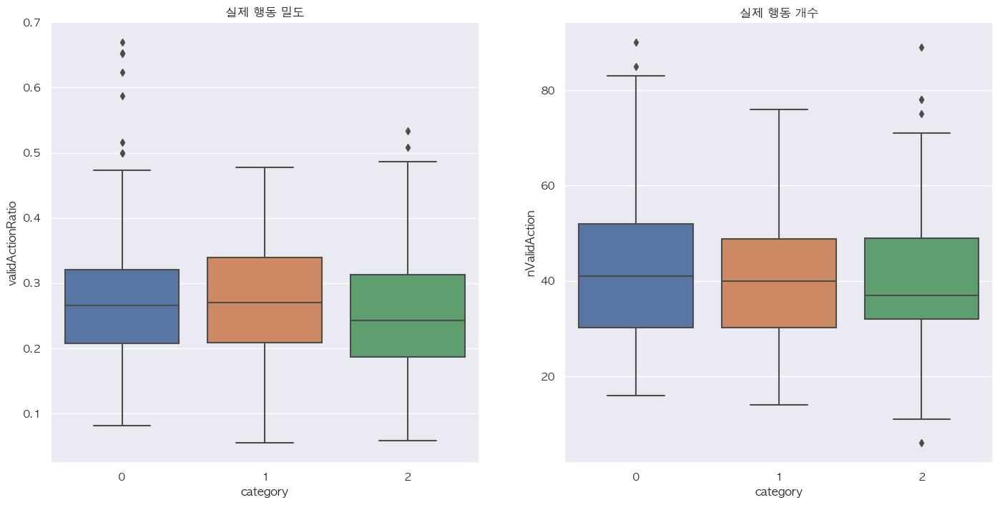
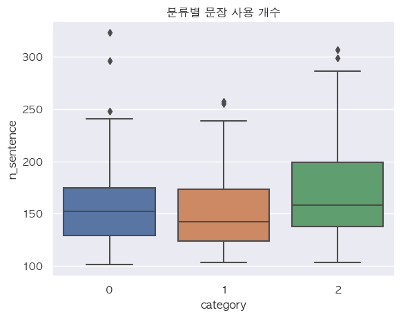

 

# EDA for Story Based Novel Hit Prediction 
`python==3.10.6`, `selenium==4.7.2` , `konlpy==0.4.4`, `mecab==0.996/ko-0.9.2`  
`scikit-learn==1.2.0`, `프로젝트 v.1.0`
  

## 프로젝트 배경
> 어떻게 작품 수급 업무를 자동화 할 수 있을까?
- 가설 수립 : *흥행하는 작품과 그렇지 못한 작품들 사이에, 스토리의 구조적인 차이점이 있을 것*
    - 차이점을 식별함에 따라 모니터링(필터링) 자동화가 가능할 것으로 기대  

- 머신러닝 기반 예측으로 인력의 개인적인 편향을 방지하고, 잠재특징들의 활용을 기대할 수 있을 것
    - e.g. 웹소설이라는 콘텐츠의 특성(낮은 관여도, 회차별 결제)을 감안 시,
        - 매 회차마다 비용에 대한 기대감을 충족시킬 수 있는 요인이 있는가?
        - 다음 회차에 대한 기대감을 유발 시킬 수 있는 전개인가?  

- 후행지표인 독자 반응이 아닌 스토리에 기반한 예측으로, 효과적인 작품 선점이 가능할 것으로 기대
    - 작품 탐색 비용 절감 및 흥행 예상 작품 선점이 가능할 것으로 기대
    - 효율적인 작품 개발 및 마케팅 전략 수립이 가능할 것으로 기대
    - 효과적인 추천시스템 개발이 가능할 것으로 기대
  

## EDA 프로젝트 목적 및 방향
> 가설 검증 및 모델링 효과성 검증
- 실제 행동 추출 
    - 행동 밀도를 통한 전개 속도 비교 목적
    - 매 회차마다 비용에 대한 기대감을 충족시키기 위해, 빠른 서사 전개가 필요할 것으로 판단
    - 실질적인 행동을 이행한 동사들만을 추출하여, 행동 밀도에 기반한 전개 속도 비교
        - 행동 밀도가 높을 수록 전개 속도가 빠른 것으로 간주할 수 있을 것
- 형용어 추출 
    - 묘사 밀도 비교 목적
    - 독자 몰입을 위해 적절한 묘사가 필요할 것으로 판단
        - 형용어를 묘사 단위로 간주
- 문장 길이 파악 
    - 호흡 길이 및 전개에 따른 호흡 변화 비교 목적 
    - 다음 회차에 대한 기대감을 유발시키기 위해 적절한 호흡 변화가 필요할 것으로 판단
    - 작품 몰입을 위해 대화와 서술에 적절한 호흡이 필요할 것으로 판단
- 모델링을 통한 아이디어 효과성 검증
  

## 주요 수행 내역
### 웹소설 스크래핑 
- 노벨피아 플러스 로맨스 소설 무료회차 스크래핑
    - 노벨피아 선정 이유 : 정식 연재 작품의 무료 공개 회차가 많음(15회차 까지)
        - 공개 회차가 많을 수록 효과성 검증에 유리할 것
    - 로맨스 소설 선정 이유 : 일상 언어 사용 비중이 높아 전처리에 용이할 것으로 기대 
    - 조회 수 기준, 상위 10%, 하위 10%, 상위 30~70% 사이의 랜덤한 10%, 작품별 11회차
    - 총 594회차의 텍스트 데이터 스크래핑
    
### EDA 목적의 텍스트 전처리
- 실제 행동 추출
    - 실질적인 행동으로 볼 수 있는 동사들만을 추출
    - 동사+선어말어미+종결어미 의 조합을 기본적인 실질적 행동으로 간주
        - e.g. ***다가왔다*** : *다가오/동사 + ㅘㅆ/선어말어미 + 다/종결어미*
    - 동사+연결어미+보조용언+선어말어미+종결어미 의 조합까지 실질적 행동으로 포함
        - e.g. ***잠들어버렸다*** : *잠들/동사 + 어/연결어미 + 버/보조용언 + 렸/선어말어미 + 다/종결어미*
    - 명사+동사파생접미사+선어말어미+종결어미 의 조합까지 실질적 행동으로 포함
        - e.g. ***시작했다*** : *시작/명사 + (하/동사파생접미사 + ㅐㅆ/선어말어미) + 다/종결어미*

- 형용어 추출
    - 형용사, 형용사파생접미사, 관형형전성어미 혹은 결합을 형용어로 간주
        - e.g. ***달려오던*** : *달려오/동사 + 던/관형형전성어미*         
    - 형용어 밀도 파악이 목적으로 결합된 다른 품사는 추출하지 않음

- 서술 및 대화 문장 분리
    - 인용부호를 대화로 간주
        - 작은따옴표를 쓰는 독백까지 대화문장으로 포함
        - 서술 시점에 따라 서술문장이 독백이 될 수 있으나, 본 프로젝트에서는 인용부호를 기준으로 분리함

### 데이터 분석 및 시각화
- 작품 분류별 행동 밀도 비교  
    
    - 하위권 작품들의 행동 밀도 중앙값이 24% 수준으로 타분류 대비 2%p 가량 낮음
    - 분류별 75% 까지의 작품들 기준, 중위권 작품들의 행동 밀도가 높음
    - 상위권 작품들 중 50%의 행동 밀도를 넘어가는 에피소드가 더러 있음

- 작품 분류별 묘사 밀도 비교  
    
    - 하위권 작품들의 형용어 밀도 중앙값이 134% 수준으로 타분류 대비 30%p 가량 낮음
    - 상위권 작품들의 형용어 밀도 중앙값이 165% 로 가장 높음
    - 하위권 작품들 중 형용어 밀도가 250%를 넘어가는 에피소드들이 더러 있음
        - 하위권 작품들이 묘사를 적절히 하지 않거나, 반대로 불필요한 묘사까지하는 경우가 있는 것으로 해석 가능

- 작품 분류별 문장 길이 비교  
    
    - 모든 작품들이 작품 후반부로 갈 수록 문장 길이가 짧아지는 경향
    - 하위권 작품들의 경우 도입부의 서술문장의 길이가 타분류 대비 짧음
        - 차분합 계산 시, 타분류 작품들보다 문장 길이 감소 정도가 20% 가량 낮음
        - 하위권 작품들이 몰입 혹은, 기대감 형성을 위한 완급조절이 상대적으로 약한 것으로 해석 가능
    - 대화문장의 경우 전개에 따른 일정한 경향성을 찾기 어려움

    
    - 대화문장과 서술문장에서의 경향성이 반대되는 모습
        - 상위권 작품일 수록 대화문장은 짧고, 서술문장은 길어지는 경향
        - 서술 중심의 전개가 독자들의 좋은 반응을 얻어내는 것으로 해석 가능
    - 하위권 작품의 대화문장 길이가 가장 긴 것으로 나타남
        - 하위권 작품일 수록 대화문장에 많은 것을 담으려하는 것으로 해석 가능
        - 몰입과 전개에 방해가 될 수 있을 것  

- 작품 분류별 사용 문장 개수 비교  
    
    - 구두점이 아닌 개행을 기준으로 문장을 분리함(구두점 중복 허용)
    - 하위권 작품들의 사용 문장 개수가 많은 것으로 나타남
        - 밀도있는 전개를 만들어내지 못하는 것으로 해석 가능

- 특징값별 작품분류와의 상관관계 파악  
    
    - 서술문장 길이의 평균이 작품분류와 -0.21 로 가장 큰 상관관계를 보이고 있음
        - 상위권 작품분류가 0 으로, 서술문장 길이가 길어질 수록 상위권 작품과 상관관계를 보임
    - 대화문장 길이의 평균이 작품분류와 0.16 의 상관관계를 보이고 있음
        - 대화문장 길이가 길어질 수록 하위권 작품과 상관관계를 보임
    - 행동 밀도와 묘사 밀도가 -0.1 수준의 상관관계를 보이고 있음
        - 행동 밀도와 묘사 밀도가 높아질 수록 상위권 작품과 상관관계를 보임
    - 상관관계 절대치가 낮아 추가적인 모델링 필요

### 머신러닝 분류 모델을 통한 효과성 검증
- 효과성 검증을 위해 상관관계가 높은 특징값들로, 머신러닝 모델들을 통해 분류 진행
    - 효과성 검증 목적으로, 별도의 추가적인 전처리없이 모델의 기본값들로만 분류 진행
    - 이용모델 : `xgboost==1.7.1`, `lightgbm==3.3.3`, `catboost==1.1.1`, `RandomForest`, `DecisionTree`, `SVM`, `KNN`
  

## 프로젝트 결과
### EDA 결과 정리
- 최대 30%p 의 차이점을 식별하며 가설검증
- 묘사 밀도, 전개에 따른 문장 길이의 변화, 서술과 대화 문장의 길이, 사용 문장 개수에서 하위권 작품들의 특징이 나타남
    - 적절한 묘사가 부족하거나, 일부는 반대로 과도한 묘사를 하는 경향이 있는 것으로 나타남
    - 호흡 변화가 상대적으로 덜 이뤄지며, 완급조절에 타분류와 차이가 있는 것으로 나타남
    - 서술문장의 길이는 상대적으로 짧고, 대화문장의 길이가 상대적으로 긴 것으로 나타남
    - 타분류 대비 많은 문장을 사용하며 회차의 밀도가 낮은 것으로 나타남
  
- 다만, 상위권과 중위권을 분류할만한 눈에 띄는 특징은 식별되지 않음
    - 일부 경향성을 띄고는 있으나, 데이터 범위가 겹치는 부분이 많다는 문제가 있음
    - 추출한 특징값만으로 작품을 명확히 분류하기는 어려울 것, 추가적인 모델링 필요

### 효과성 검증 결과

|모델|정확도|정밀도|재현율|f1-score|
|--|--|--|--|--|
xgboost | 0.63 | 0.63 | 0.64(best) | 0.63
LGBM | 0.55 | 
catboost | 0.62 | 0.62 | 0.62 | 0.62 
RandomForest | 0.64(best) | 0.67(best) | 0.63 | 0.64(best)
DesicsionTree | 0.61 | 0.65 | 0.61 | 0.63
SVM | 0.43
KNN | 0.58

- 모델 분류 결과, 추출한 특징값만으로도 양호한 성능으로 작품들을 분류해냄
    - 아이디어 효과성 검증 완료
    - 모델 학습을 위한 데이터 전처리 및 하이퍼파라미터 최적화 없이 진행한 실험 결과로, 머신러닝 모델로도 추가 성능 향상 가능성 존재
    - `RandomForest` 모델 기준
        - 상위권 작품 분류 정확도 62.06%
        - 중위권 작품 분류 정확도 68.75%
        - 하위권 작품 분류 정확도 57.89%
    - `XGBoost` 모델 기준
        - 상위권 작품 분류 정확도 58.62%
        - 중위권 작품 분류 정확도 59.37%
        - 하위권 작품 분류 정확도 73.68%

### 향후 과제
- 실제 행동들을 의미에 따라 분류하여 서사 전개 방식 비교
    - 소재 의존도를 낮추며 일반화 성능을 제고할 수 있을 것으로 기대
    - e.g. 이동동사 : 등장인물의 등장 및 퇴장, 장소의 변화
    - e.g. 수여동사 : 사건의 촉발 및 종료(암시)

- 시퀀스 데이터 기반 딥러닝 모델링로 분류(별도의 프로젝트로 진행)
    - 소재 의존도를 낮추기 위해 일반화할 필요
    - 스토리의 잠재적 특성을 이용한 분류가 가능할 것으로 기대
  

## Reference
- 음성원, 장웅조, 2022, 웹소설에서의 회귀, 환생 모티브 활용 연구
- 한국민족문화대백과사전
